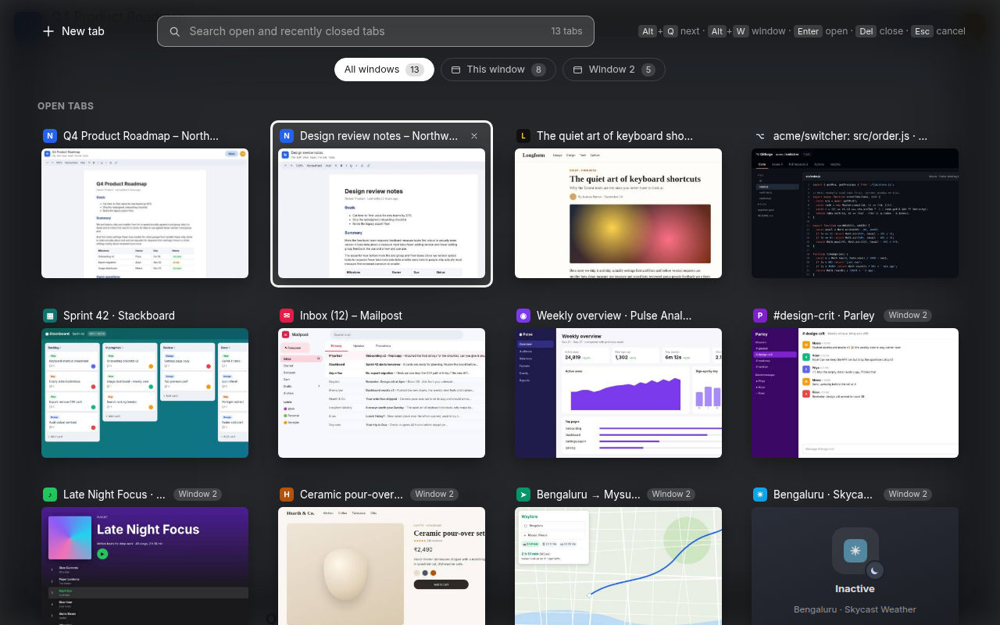

# Tabatha

**Alt+Tab for Chrome tabs.** Press <kbd>Alt</kbd>+<kbd>Q</kbd> to see live previews of every open tab, search them, jump between windows, and reopen the ones you just closed.



## Store
https://chromewebstore.google.com/detail/edjglhlabdmgacehahfdjjffapbkaekk?utm_source=item-share-cb

## Features

- **Live previews**: a screenshot of every tab, not just a favicon and a title.
- **Tap to open**: tap <kbd>Alt</kbd>+<kbd>Q</kbd> and the switcher stays open. No need to keep holding Alt: use the arrows, type to search, or use the mouse.
- **Or hold and release**: hold Alt and tap Q again to move through tabs in most-recently-used order, let go to switch, like Alt+Tab.
- **Search**: type to filter open tabs and tabs closed in the last 7 days by title or URL.
- **Every window in one view**: each card shows the site and which window it's in. Filter to one window with <kbd>Alt</kbd>+<kbd>W</kbd> or the window chips.
- **Recently closed**: reopen tabs and windows closed in the last 4 hours, with their last preview. Tabatha also keeps its own 7-day list (up to 200 tabs, on your computer), so searching finds tabs that Chrome's own 25-item list has already forgotten.
- **Sleeping tabs**: tabs Chrome puts to sleep while you browse are marked *Sleeping* (their last preview stays, faded). After you reopen the browser, tabs keep their saved preview. Tabs Tabatha hasn't been able to screenshot yet say *No preview yet*.
- **Tab groups (optional)**: your Chrome tab groups show as sections with their name and colour. Close a group, or its window, and Tabatha keeps it under *Saved tab groups* until you remove it; <kbd>Enter</kbd> reopens it as a real group. Switched on from the footer ("Turn on tab groups"), which asks Chrome for one extra, optional permission.
- **A short tour**: a "Press Alt+Q" notice after you install, and a five-step tour the first time you open Tabatha (replay it with *How it works*).
- **Close from the switcher**: <kbd>Del</kbd> (<kbd>⌘</kbd>+<kbd>⌫</kbd> on a Mac) or middle-click.
- **Works everywhere**: on pages extensions can't draw on (New Tab, `chrome://`, the Web Store) it opens in a small popup window instead.
- **Free**: a small Buy Me a Coffee button sits in the corner of the switcher, if you want to say thanks.
- **Private**: previews are saved on your computer (not uploaded) so they survive a restart: kept while the tab is open, and for 7 days after you close it; uninstalling Tabatha deletes them. The extension itself makes no network requests; the coffee button just opens buymeacoffee.com in a new tab when you click it. See [PRIVACY.md](PRIVACY.md).

## Shortcuts

_Current: 1.3.2 (no shortcut changes since 1.3.1). Older versions are kept below under "Shortcut history"._

| Keys | Action |
|---|---|
| <kbd>Alt</kbd>+<kbd>Q</kbd> / <kbd>Alt</kbd>+<kbd>Shift</kbd>+<kbd>Q</kbd> | Open (stays open), then next / previous tab |
| <kbd>Alt</kbd>+<kbd>W</kbd> | Cycle window filter |
| Arrows, <kbd>Tab</kbd> | Move selection |
| <kbd>Enter</kbd> or click | Switch to selected tab |
| Release <kbd>Alt</kbd> after pressing Q again | Switch to selected tab (Alt+Tab style) |
| <kbd>Del</kbd> / <kbd>⌘</kbd>+<kbd>⌫</kbd> (Mac) | Close selected tab |
| <kbd>Esc</kbd> or click outside | Clear search / close |

On macOS, Alt is <kbd>Option</kbd>. To change the shortcut, go to `chrome://extensions/shortcuts`.

### Shortcut history (newest first)

**1.3.1** (30 Sep 2026)
- <kbd>Alt</kbd>+<kbd>Q</kbd> now only *opens* Tabatha; it stays open after you let go. In 1.3.0, letting go of Alt switched straight away.
- Letting go of <kbd>Alt</kbd> switches only if you pressed Q *again* while holding it.
- New: arrow keys and the mouse work without holding anything; <kbd>Esc</kbd> or clicking outside closes.
- New on Mac: <kbd>⌘</kbd>+<kbd>⌫</kbd> closes the selected tab (the Mac "delete" key is Backspace, so <kbd>Del</kbd> didn't work).
- <kbd>Alt</kbd>+<kbd>W</kbd> unchanged, but no longer types "∑" on a Mac and is only shown in the hint bar when you have more than one window.

**1.3.0** (27 Sep 2026, first release)

| Keys | Action |
|---|---|
| <kbd>Alt</kbd>+<kbd>Q</kbd> / <kbd>Alt</kbd>+<kbd>Shift</kbd>+<kbd>Q</kbd> | Open, next / previous tab |
| <kbd>Alt</kbd>+<kbd>W</kbd> | Cycle window filter |
| Arrows, <kbd>Tab</kbd> | Move selection |
| <kbd>Enter</kbd> or release <kbd>Alt</kbd> | Switch to selected tab |
| <kbd>Del</kbd> | Close selected tab |
| <kbd>Esc</kbd> | Clear search / close |

## What's new (newest first)

**1.3.2** (2 Oct 2026, amended 4 Oct before submission): **tab groups** as sections, with closed groups kept until you remove them (optional `tabGroups` permission, off until you switch it on); a **first-run notice and tour**; a **review reminder** (a quiet banner a few times, one dialog much later; it offers a review and a feedback link whatever your answer); previews are saved on disk and survive a browser restart; a preview is kept while a tab with that page is open (7 days after it closes); "Sleeping" only for tabs Chrome really put to sleep while you browse, so tabs restored after a restart show their preview normally; a 7-day closed-tab list (200 tabs, beyond Chrome's 25-item limit) that search can reach; no more nonsense time on closed windows. Full notes: [releases/v1.3.2/release-notes.md](releases/v1.3.2/release-notes.md).

**1.3.1** (30 Sep 2026): tap-to-open; recently closed limited to the last 4 hours (max 8, max 2 windows); site and window shown on every card, window numbers that stay put; "Inactive" now means unloaded by Chrome, with "No preview yet" for uncaptured tabs; Mac fixes (Option+W, Option+key typing, ⌘⌫); Buy Me a Coffee button. Full notes: [releases/v1.3.1/release-notes.md](releases/v1.3.1/release-notes.md).

**1.3.0** (27 Sep 2026): first public release. Live previews, hold-and-release switching, search, window filter, recently closed, close from the switcher, popup fallback. Notes: [releases/v1.3.0/release-notes.md](releases/v1.3.0/release-notes.md).

## Install from source

1. Clone this repo.
2. Open `chrome://extensions` and turn on **Developer mode**.
3. Click **Load unpacked** and pick the `extension/` folder.

Requires Chrome 116+.

## Repository layout

```
extension/            the extension source (what gets zipped and published)
releases/v<version>/  per-release artefacts: submitted zip, store listing text, screenshots, promo tiles, notes
tools/screenshots/    scripts that regenerate the store screenshots with fictional demo sites
PRIVACY.md            privacy policy (linked from the Chrome Web Store)
```

## How it works

- `background.js` (service worker) tracks tab usage order, captures a downscaled screenshot whenever a tab becomes visible, and opens the switcher.
- The switcher (`switcher.html/js/css`) is injected as a full-page iframe over the current tab. On pages where that's impossible, it opens in a popup window.
- `hotkey.js` is a tiny content-script fallback for Alt+Q, in case Chrome's shortcut is taken by another app.
- Tab previews live in `chrome.storage.local` (on disk, keyed by URL; kept while any open tab has that URL, else 7 days; max 300 / ~6 MB). Everything else (tab order, one-time tokens) lives in `chrome.storage.session` (memory only).
- The switcher only renders when it gets a one-time launch token from the background worker. Clicks only count while the overlay is actually visible, which guards against clickjacking by hostile pages.

## License

[MIT](LICENSE)
